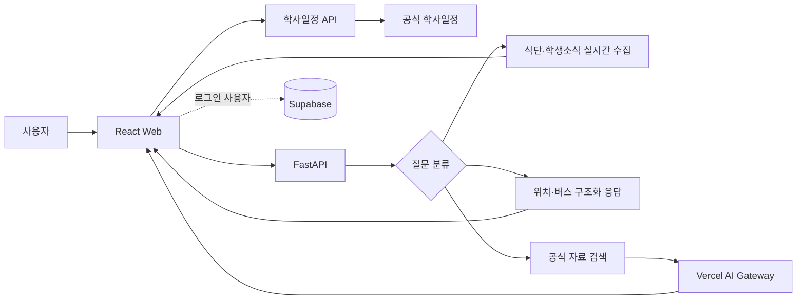

<p align="center">
  
</p>

<h1 align="center">PORTY</h1>

<p align="center">
  흩어진 공주대학교 정보를 질문 한 번으로 찾는 캠퍼스 챗봇
</p>

<p align="center">
  <a href="https://porty-ai-campus.vercel.app"><strong>서비스 이용하기</strong></a>
  ·
  <a href="https://porty-ai-campus.vercel.app/health">서비스 상태</a>
</p>

<p align="center">
  
  
  
  
  
</p>

## 프로젝트 소개

학사일정은 학교 홈페이지, 식단은 학생식당과 생활관 페이지, 버스 시간표와
학생소식은 또 다른 게시판에 있습니다. PORTY는 이 정보를 한 대화창에서
찾고, 일정·식단·시간표처럼 표가 필요한 정보는 읽기 쉬운 화면으로 보여주는
공주대학교 캠퍼스 도우미입니다.

기존 [PORTY 프론트엔드](https://github.com/lllillly/Porty)와
[PORTY 데이터 프로젝트](https://github.com/lllillly/PortyProject)를 바탕으로,
검색·실시간 데이터 수집·인증·배포 구조를 다시 설계한 개인 고도화
프로젝트입니다.

| 구분 | 내용 |
| --- | --- |
| 개발 기간 | 2026.07 |
| 개발 형태 | 개인 리빌드 및 기능 고도화 |
| 배포 | Web과 API를 하나의 Vercel 프로젝트로 운영 |
| 데이터 | 공주대학교 공식 홈페이지 및 생활관 페이지 |
| 검증 | Vitest 19개, Pytest 59개 |

## 해결하고 싶었던 문제

| 문제 | PORTY의 해결 방식 |
| --- | --- |
| 필요한 정보가 여러 홈페이지에 흩어져 있음 | 질문 의도를 분류해 일정·식단·소식·위치·버스 기능으로 바로 연결 |
| 챗봇 답변만으로는 시간표와 일정이 읽기 어려움 | 캘린더, 시간표, 뉴스, 식단 전용 카드로 응답 |
| 학기마다 바뀌는 정보를 오래된 자료로 안내할 수 있음 | 실시간 조회와 자료 기준일을 함께 사용하고, 운행기간이 지난 버스 자료는 안내 중지 |
| 생성 모델이 학교에 없는 내용을 추측할 수 있음 | 공식 자료 검색 결과가 있을 때만 생성하고 출처를 함께 표시 |
| “두 번째 글 보여줘” 같은 후속 질문이 끊김 | 같은 세션의 최근 대화와 앞서 안내한 공식 링크를 이어서 사용 |

## 주요 기능

### 학사일정

- “이번 달 학사일정 알려줘”, “중간고사 언제야?”처럼 말로 물어봐도
  캘린더를 엽니다.
- 공주대학교 학사일정 페이지에서 월별 데이터를 불러옵니다.
- 날짜 범위가 있는 일정은 시작일과 종료일을 달력에 함께 표시합니다.

### 학생소식

- 공식 학생소식 게시판의 최신 글 3개를 실시간으로 가져옵니다.
- 목록에서 제목·작성일·미리보기를 확인하고 원문으로 이동할 수 있습니다.
- “2번 내용 보여줘”라고 이어서 물으면 해당 글의 본문, 이미지, 첨부파일을
  같은 대화에서 보여줍니다.

### 식단

- 공주·천안·예산 학생식당과 생활관 식단을 실시간으로 조회합니다.
- 자주 이용하는 캠퍼스와 식당을 저장해 다음부터 바로 확인할 수 있습니다.
- 페이지 연결이나 파싱이 실패하면 지난 메뉴를 대신 보여주지 않고 오류
  상태를 명확히 표시합니다.

### 순환버스와 무료버스

- 가장 자주 찾는 순환버스를 천안 시내, 캠퍼스 간, 예산·신창 노선으로
  나누어 표로 제공합니다.
- 출발지와 도착지를 함께 말하면 요청한 방향의 노선만 골라 보여줍니다.
- 현재 날짜와 학기 운행기간을 비교해 운행 중·운행 예정·종료 상태를
  구분합니다.

### 캠퍼스 위치

- “9공학관이 어디야?”, “학생상담센터 위치 알려줘”처럼 건물명을 물으면
  캠퍼스와 도로명 주소를 먼저 답합니다.
- 여러 캠퍼스에 같은 시설이 있으면 임의로 정하지 않고 캠퍼스를 다시
  지정하도록 안내합니다.
- 상세 위치는 공식 캠퍼스맵으로 연결합니다.

### 대화와 개인 설정

- 브라우저 세션 안에서 최근 대화를 기억합니다.
- 이메일 로그인 사용자는 Supabase에 대화와 설정을 저장할 수 있습니다.
- 다크 모드, 식단 기본값, 빠른 질문을 지원합니다.

## 동작 구조



웹과 FastAPI를 같은 도메인에 배포해 별도 백엔드 주소나 CORS 설정 없이
`/api`로 통신합니다. 학사일정은 CSRF 토큰과 세션 쿠키가 필요한 공식
페이지 특성 때문에 별도 서버리스 함수에서 처리합니다.

### 답변 처리 순서

1. 욕설, 인사말, 학교 소개처럼 범위가 명확한 입력을 먼저 처리합니다.
2. 학사 제도, 학생소식, 식단, 버스, 위치 질문을 각 전용 핸들러로 보냅니다.
3. 그 외 학교 질문은 159개의 정제 문서에서 관련 자료를 검색합니다.
4. 검색 근거가 있으면 Gemini 2.5 Flash Lite가 존댓말 답변을 작성합니다.
5. 모델을 사용할 수 없으면 같은 근거로 추출형 답변을 반환합니다.
6. 근거가 없으면 아는 척하지 않고 확인할 수 없다고 안내합니다.

## 기술 선택

| 영역 | 기술 | 선택 이유 |
| --- | --- | --- |
| Frontend | React 19, Vite 8 | 카드 단위 상태 관리와 빠른 개발·빌드 환경 |
| Styling | styled-components | 대화 카드별 동적 스타일과 다크 모드 처리 |
| API | FastAPI, Pydantic | 질문 유형별 응답 스키마와 Python 수집 로직을 한 서비스에서 관리 |
| 수집 | httpx, BeautifulSoup | 학교·생활관 페이지의 실시간 데이터 파싱 |
| 검색 | 한국어 토큰 확장 + BM25 계열 검색 | 별도 벡터 DB 없이 작은 공식 문서 집합을 빠르게 검색 |
| 답변 생성 | Vercel AI Gateway, Gemini 2.5 Flash Lite | 검색 근거를 자연스러운 답변으로 정리하고 배포 환경에서는 OIDC로 인증 |
| 인증·저장 | Supabase Auth, Postgres, RLS | 이메일 로그인과 사용자별 데이터 접근 제어 |
| 배포 | Vercel | Vite 정적 빌드와 Python·Node 서버리스 함수를 한 프로젝트로 배포 |
| 테스트 | Vitest, Pytest | UI 출력, 질문 라우팅, 수집 파서, API 응답을 회귀 테스트 |

## 구현 과정에서 해결한 문제

### 1. 관련 자료를 찾았는데도 핵심 답변이 뒤로 밀리는 문제

검색 점수만 따라 문장을 재정렬하면 “공식 홈페이지에서 확인하세요” 같은
주의 문구가 실제 답보다 먼저 나왔습니다. 정제 문서는 첫 문장에 결론을 두는
규칙으로 작성하고, 추출형 답변도 첫 문장을 유지한 뒤 관련 조건을 붙이도록
바꿨습니다.

### 2. 학생소식 후속 질문이 새로운 검색으로 처리되는 문제

“내용 보여줘”만으로는 어떤 글인지 알 수 없었습니다. 최근 assistant 응답에서
공식 학생소식 URL을 복원하고, 사용자가 말한 번호와 연결해 상세 페이지를
가져오도록 했습니다. 세션 전체를 무제한 전송하지 않고 최근 대화만 사용해
요청 크기도 제한했습니다.

### 3. 공식 학사일정 API가 직접 호출을 거부하는 문제

월별 일정 API는 홈페이지에서 발급한 CSRF 토큰과 쿠키가 함께 있어야
동작했습니다. 먼저 일정 페이지를 요청해 토큰과 세션을 얻은 뒤 월별 API를
호출하도록 서버리스 함수를 구성했고, 응답은 1시간 캐시해 반복 요청을
줄였습니다.

### 4. 버스 답변이 긴 텍스트 덩어리로 보이는 문제

노선마다 정류장 수와 시간표 열이 달라 일반 Markdown 표로는 모바일 화면을
유지하기 어려웠습니다. API는 `presentation` 데이터로 열·행·운행 상태를
전달하고, 프론트는 노선 그룹별 반응형 시간표를 렌더링하도록 분리했습니다.

### 5. 로그인 없이도 쓸 수 있으면서 대화는 안전하게 저장해야 하는 문제

기본 사용은 로그인 없이 브라우저 세션에만 저장합니다. 이메일로 로그인한
경우에만 Supabase 저장을 시도하며, 저장 실패가 채팅 답변까지 막지 않도록
분리했습니다. 데이터베이스에는 RLS를 적용해 본인의 설정·대화만 접근할 수
있습니다.

## 프로젝트 구조

```text
porty-ai-campus
├── api
│   ├── calendar.js          # 실시간 학사일정 서버리스 함수
│   └── index.py             # Vercel FastAPI 진입점
├── apps/web
│   └── src
│       ├── api              # 채팅·콘텐츠·인증 요청
│       ├── components       # 대화, 캘린더, 식단, 버스, 소식 UI
│       ├── pages            # 채팅·상태 페이지
│       ├── styles           # 화면별 스타일
│       └── utils            # 질문 의도와 세션 저장
├── services/ai
│   ├── app
│   │   ├── campus.py        # 캠퍼스·건물 위치 응답
│   │   ├── generator.py     # 근거 기반 생성과 추출형 대체 응답
│   │   ├── main.py          # API 및 질문 라우팅
│   │   ├── meal_scraper.py  # 학생식당·생활관 식단 수집
│   │   ├── retrieval.py     # 한국어 검색
│   │   └── student_news.py  # 학생소식 목록·본문 수집
│   ├── data                 # 정제 문서와 버스·대화 데이터
│   └── tests
├── supabase
│   ├── migrations           # 스키마, 트리거, RLS 정책
│   └── seed.sql
└── vercel.json
```

## 로컬 실행

Node.js 22 이상과 Python 3.14 환경을 권장합니다.

```bash
git clone https://github.com/lllillly/porty-ai-campus.git
cd porty-ai-campus

npm install

python3 -m venv services/ai/.venv
services/ai/.venv/bin/pip install -r services/ai/requirements.txt
```

API와 웹을 각각 실행합니다.

```bash
# 터미널 1
npm run dev:api

# 터미널 2
npm run dev
```

| 주소 | 용도 |
| --- | --- |
| `http://localhost:5173` | PORTY 웹 |
| `http://localhost:8000/docs` | FastAPI 문서 |
| `http://localhost:5173/health` | 서비스 연결 상태 |

Vite가 `/api` 요청을 `localhost:8000`으로 전달하므로 로컬에서는
`VITE_AI_API_URL`을 비워둘 수 있습니다.

## 환경변수

`.env.example`을 복사해 `.env`를 만들고 필요한 값만 설정합니다.

```text
VITE_SUPABASE_URL=
VITE_SUPABASE_PUBLISHABLE_KEY=
VITE_AI_API_URL=

PORTY_DATA_PATH=services/ai/data/knowledge.json
PORTY_TOP_K=3
PORTY_ALLOWED_ORIGINS=http://localhost:5173
PORTY_AI_MODEL=google/gemini-2.5-flash-lite
AI_GATEWAY_API_KEY=
```

- Supabase 값이 없으면 로그인과 영구 저장만 비활성화되며 채팅은 동작합니다.
- `AI_GATEWAY_API_KEY`가 없으면 공식 자료를 이용한 추출형 답변으로 동작합니다.
- `.env`, 인증서, 키 파일, 로컬 Vercel 설정은 Git에서 제외합니다.

### Supabase 설정

Supabase SQL Editor에서 아래 파일을 순서대로 실행합니다.

```text
supabase/migrations/20260724000100_initial_schema.sql
supabase/seed.sql
```

로컬 Supabase를 사용할 때는 Docker 호환 런타임을 준비한 뒤 실행합니다.

```bash
npm run supabase:start
npm run supabase:reset
```

## 테스트

```bash
# 프론트 테스트 + API 테스트 + 프로덕션 빌드
npm run check
```

현재 검증 범위는 다음과 같습니다.

- 학사일정 자연어 라우팅
- 학생소식 목록·상세 파싱과 후속 질문
- 캠퍼스 건물·주소 질문
- 식단 HTML 파싱과 오류 처리
- 순환버스 표와 방향별 노선
- 검색 점수, 동의어 확장, 근거 없는 질문 차단
- Supabase 비연결 상태의 채팅 동작

## 배포

GitHub 저장소를 Vercel에서 Import하고 루트 디렉터리를 그대로 사용합니다.
`vercel.json`이 Vite 빌드 결과와 FastAPI·학사일정 함수를 함께 배포합니다.

Vercel에는 Supabase를 사용할 때만 아래 환경변수를 등록합니다.

```text
VITE_SUPABASE_URL
VITE_SUPABASE_PUBLISHABLE_KEY
```

배포된 FastAPI가 AI Gateway를 호출할 때는 Vercel의 단기 OIDC 토큰을
사용합니다. 장기 모델 API 키를 저장소에 올리거나 배포 환경변수에 별도로
보관하지 않습니다.

## 데이터와 개인정보 기준

`scripts/build_knowledge.py`는 공식 홈페이지 크롤링 스냅샷에서 메뉴, 팝업,
중복 문구를 제거하고 전화번호·이메일과 개인 게시판 데이터를 제외합니다.
생성된 문서는 저장소에서 버전 관리해 답변 근거가 갑자기 달라지지 않도록
했습니다.

학사일정, 식단, 버스 시간표는 학교 사정에 따라 변경될 수 있습니다. PORTY는
가능한 경우 공식 페이지를 실시간으로 조회하고, 모든 주요 응답에 원문 링크를
함께 제공합니다.
